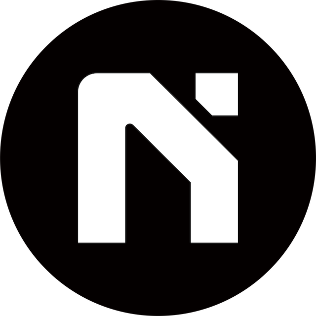

# Nal brand-kit

This repo contains brand logos for Nal.

Nal is a secure, low-cost, developer-friendly Ethereum L2 built to bring the next billion users onchain. It's built on Optimism’s open-source [OP Stack](https://stack.optimism.io/).

### Logos

